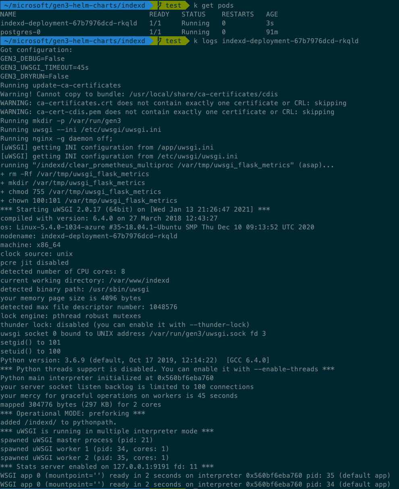

# Gen3 Helm Charts

## Prerequisites

1. A kubernetes cluster
2. Helm 3 installed

## Getting Started

### Configuring Secrets

Before deploying to a Kubernetes cluster, you must enable the cluster to consume Secrets in a volume in a Pod. Some of these scripts can be found in the `\indexd\scripts` directory. `ca.pem`, `service.crt`, and `service.key` will need to be self generated.

For `indexd-secret`:
```
kubectl create secret generic indexd-secret --from-file=local_settings.py=./indexd_settings.py
```

For `indexd-creds`:
```
kubectl create secret generic indexd-creds --from-file=creds.json=./indexd_creds.json
```

For `config-helper`:
```
kubectl create configmap config-helper --from-file=./config_helper.py
```

For `cert-volume`:
```
kubectl create secret generic "cert-indexd-service" --from-file=service.crt --from-file=service.key
```

For `ca-volume`:
```
kubectl create secret generic "service-ca" --from-file=ca.pem
```

### Deploying Postgres (dependency)

Recommended to use the stable binami postgresql image [here](https://github.com/bitnami/charts/tree/master/bitnami/postgresql/#installing-the-chart).

To deploy postgresl this way, run:

```
$ helm repo add bitnami https://charts.bitnami.com/bitnami
$ helm install postgres -f values.yaml bitnami/postgresql
```
where the `values.yml` can be found in `\postgres\values.yaml` of this repo.


### Deploy Microservice

```
cd indexd
helm install indexd .
kubectl get pods
```

When deployed successfully, you should see the following (or similar) logs for `indexd`:



## Uninstall Services

```
helm uninstall indexd
helm uninstall postgres
```

## Notes

`helm install indexd . --dry-run` is a good way to have the server render templates and display final kubernetes manifest files.

`kubectl decribe pods` is a good way to show logs for kubenertes pods that are stuck in pending state if `kubectl logs` does not help.
